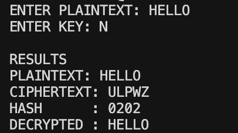
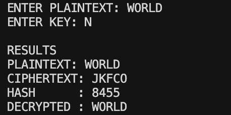

# Autokey Cipher with Mid-Square Hash

## OVERVIEW

This project implements the **Autokey (Autoclave) Cipher** along with a **Mid-Square Hash Function** using Python.

The Program allows:

* Encryption of plaintext using Autokey Cipher
* Decryption of Cipher text
* Generating a Hash Value using Mid-Square method
* Verifying the Correctness using a Round-Trip Test (Encrypt → Hash → Decrypt)

---

## THEORY

### 1. Autokey Cipher

The Autokey Cipher is a type of Substitution Cipher.

* A short Key is given initially
* Then the Plaintext is added to the Key
* This forms a longer Key
* Each Letter is Encrypted using Modular Addition

**Encryption Formula:**
Ci = (Pi + Ki) mod 26

**Decryption Formula:**
Pi = (Ci - Ki) mod 26

Where:
P = Plaintext
K = Key
C = Cipher text

---

### 2. Mid-Square Hash Function

The Mid-Square method is used to generate a Hash value.

**Steps followed in this Project:**

1. Converts Cipher text into a Number using ASCII values
2. Square the Number
3. Extract the Middle Digits of the Squared Value (4 Digits)
4. Return those Digits as the Hash

**Reason for choosing this Method:**

* It gives a Better Distribution than Simple Addition-based Hashes
* Easy to Understand and Implement
* Different from Commonly Used Hash Methods

---

## STEPS TO RUN THIS CODE:

### STEP 1: Run Main Program

```
python autokey.py
```

### STEP 2: Run Test Script

```
python test.py
```

---

## EXAMPLES

### EXAMPLE 1

PLAINTEXT : HELLO
KEY : N

CIPHER TEXT: ULPWZ
HASH : 0202
DECRYPTED TEXT : HELLO

---

### EXAMPLE 2

PLAINTEXT : WORLD
KEY : KEY

CIPHER TEXT : GSPHR
HASH : 0649
DECRYPTED TEXT : WORLD

---

## REFERENCES

* https://www.geeksforgeeks.org/computer-networks/autokey-cipher-symmetric-ciphers/
* https://www.geeksforgeeks.org/dsa/hash-functions-and-list-types-of-hash-functions/
* https://en.wikipedia.org/wiki/Autokey_cipher
* https://crypto.interactive-maths.com/autokey-cipher.html

---

## CONCLUSION

This Repository demonstrates how the **Autokey Cipher** works along with a **Mid-Square Hash Function**.

---

## OUTPUT





---
